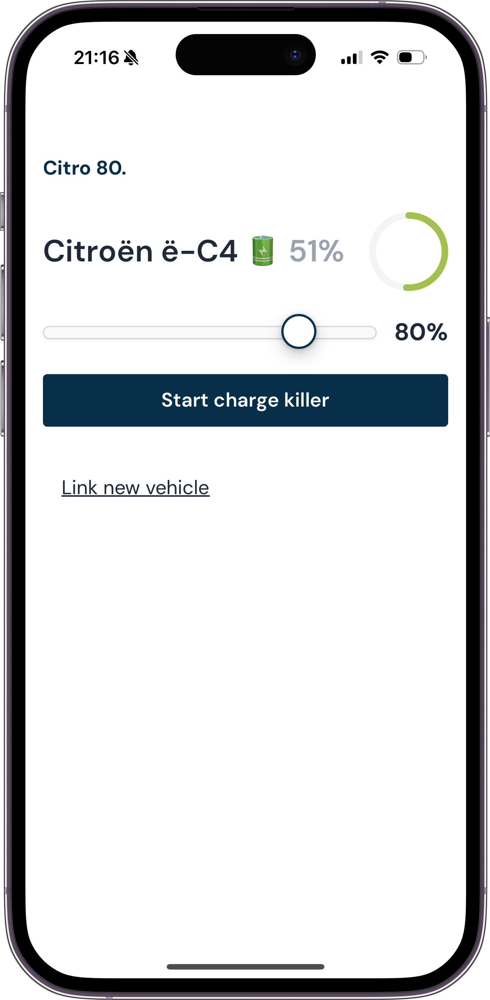

# Citro 80.

Integrate with you Citroën EV to automatically stop charging at a battery level you choose, e.g. 80%.

## Why?

Citroën doesn't allow you to set a charging limit in their own app, so here we are.
